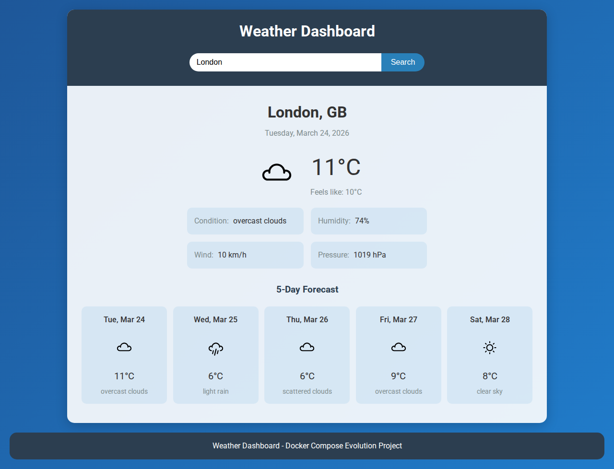

# Weather Dashboard - Learn Docker Compose Evolution

> **Hands-on exercise**: Evolve a monolithic weather app into a production-style three-tier architecture using Docker and Docker Compose. Step by step.



## What You'll Learn

- [ ] Containerizing a Node.js application with Docker
- [ ] Adding Redis caching with Docker Compose
- [ ] Setting up Nginx as a reverse proxy
- [ ] Separating static files from the API server
- [ ] Network isolation between frontend and backend
- [ ] Managing environment variables and secrets in containers

## Prerequisites

- Docker and Docker Compose installed ([install guide](https://docs.docker.com/get-docker/))
- A free OpenWeatherMap API key (see setup below)
- Basic comfort with the terminal

## Getting Started

```bash
git clone https://github.com/CarmitHaas/docker-compose-weather-dashboard.git
cd docker-compose-weather-dashboard
```

### Get Your API Key

This app fetches real weather data from OpenWeatherMap. You need a free API key:

1. Go to [openweathermap.org](https://openweathermap.org/api) and sign up (free)
2. Find your API key in your account dashboard
3. Copy `.env.example` to `.env` and paste your key:

```bash
cp .env.example .env
# Edit .env and replace your_api_key_here with your actual key
```

> **Note**: The free tier allows 60 API calls per minute - plenty for development.

### Run It Locally First

```bash
npm install
npm start
```

Open http://localhost:3000 and search for a city. You should see current weather and a 5-day forecast.

## The App

This is a weather dashboard that:
- Lets users search for any city
- Shows current temperature, conditions, humidity, and wind
- Displays a 5-day forecast
- Remembers the last searched city (localStorage)

**Architecture today**: Everything runs in a single Node.js process - Express serves the static HTML/CSS/JS AND proxies weather API requests.

**Your mission**: Evolve this into a proper three-tier architecture.

## Stage 1: Containerize the Monolith

**Create a `Dockerfile`** for this Node.js application.

### Think About...

- What base image for a Node.js app?
- How do you pass the API key to the container without hardcoding it?
- What about `node_modules` - should you copy them from your machine or install fresh in the container?

### Hints

<details>
<summary>Hint 1: Dockerfile structure</summary>

```dockerfile
FROM node:20-alpine
WORKDIR /app
COPY package*.json ./
RUN npm install --production
COPY . .
EXPOSE 3000
CMD ["node", "server.js"]
```

</details>

<details>
<summary>Hint 2: Passing the API key</summary>

Run with: `docker run -p 3000:3000 --env-file .env weather-dashboard`

The `--env-file` flag reads your `.env` file and passes all variables to the container.

</details>

### Verify Stage 1

```bash
docker build -t weather-dashboard .
docker run -p 3000:3000 --env-file .env weather-dashboard
```

Open http://localhost:3000 - the app should work exactly as before, but now it's containerized.

---

## Stage 2: Add Redis Caching

Every time you search for a city, the app makes a fresh API call to OpenWeatherMap. Let's add Redis to cache results.

### Your Mission

1. Add the `redis` package to `package.json`
2. Modify `server.js` to check Redis cache before calling the API
3. Create a `docker-compose.yaml` with two services: the app and Redis
4. Connect them via a shared network

### Think About...

- How does the app know where Redis is? (Environment variable for the host)
- How long should weather data be cached? (30 minutes is reasonable)
- What happens if Redis is down - should the app crash or fall back to the API?
- Should Redis be accessible from outside the container network?

### Hints

<details>
<summary>Hint 1: Redis caching pattern</summary>

```javascript
// Check cache first
const cached = await redisClient.get(cacheKey);
if (cached) return res.json(JSON.parse(cached));

// If not cached, fetch from API
const response = await axios.get(apiUrl);

// Store in cache with expiration
await redisClient.setEx(cacheKey, 1800, JSON.stringify(response.data));

return res.json(response.data);
```

</details>

<details>
<summary>Hint 2: docker-compose.yaml structure</summary>

```yaml
services:
  app:
    build: .
    ports:
      - "3000:3000"
    environment:
      - REDIS_HOST=redis
    env_file:
      - .env
    depends_on:
      - redis

  redis:
    image: redis:alpine
    volumes:
      - redis_data:/data

volumes:
  redis_data:
```

</details>

### Verify Stage 2

```bash
docker compose up -d
```

Search for a city, then search again - check the backend logs (`docker compose logs app`). The second search should say "Using cached data" instead of "Fetching from API".

---

## Stage 3: Add Nginx Reverse Proxy

Right now Express does two jobs: serves static files AND handles API requests. In production, Nginx handles static files much more efficiently.

### Your Mission

1. Create an `nginx.conf` that serves static files and proxies `/api/` to the Express backend
2. Add Nginx as a third service in `docker-compose.yaml`
3. Remove the static file serving from Express (the `express.static` line)
4. Set up network isolation: frontend network (Nginx <-> Express) and backend network (Express <-> Redis)
5. Only expose port 80 (Nginx) to the host - remove the port mapping from the app service

### Think About...

- After this change, which service is the only entry point from the internet?
- Why is it better for Nginx to serve static files instead of Express?
- Can Nginx reach Redis directly? Should it be able to?
- How does `env_file` work in Docker Compose for passing the API key?

### Hints

<details>
<summary>Hint 1: nginx.conf</summary>

```nginx
server {
    listen 80;

    location / {
        root /usr/share/nginx/html;
        try_files $uri $uri/ /index.html;
    }

    location /api/ {
        proxy_pass http://app:3000;
        proxy_set_header Host $host;
        proxy_set_header X-Real-IP $remote_addr;
    }
}
```

</details>

<details>
<summary>Hint 2: Network isolation</summary>

```yaml
networks:
  frontend-network:  # Nginx <-> App
  backend-network:   # App <-> Redis

# Nginx: only frontend-network
# App: both networks
# Redis: only backend-network
```

</details>

### Verify Stage 3

```bash
docker compose up -d
```

- Open http://localhost (port 80, not 3000!)
- The app should work exactly as before
- Test network isolation:

```bash
# This should FAIL - Nginx can't reach Redis
docker compose exec nginx ping redis

# This should SUCCEED - App can reach Redis
docker compose exec app ping redis
```

## Key Takeaways

- **Start simple, evolve gradually**: You don't need to design the perfect architecture upfront. Start with a monolith, then split when you understand the needs.
- **Redis caching** dramatically reduces API calls and improves response times - a pattern used in almost every production web app
- **Nginx as a reverse proxy** is the industry standard for serving static files and routing traffic to backend services
- **Network isolation** ensures your database is never directly accessible from the internet - only the services that need it can reach it
- **Environment variables** keep secrets (like API keys) out of your code and Docker images

## Solution Branches

Each stage has its own solution branch:

```bash
git checkout solution/step-1-dockerfile     # Stage 1: Dockerfile
git checkout solution/step-2-add-redis      # Stage 2: Redis caching
git checkout solution/step-3-add-nginx      # Stage 3: Full three-tier
git checkout solution                       # Final state (same as step-3)
```

## Bonus Challenges

1. **Add cache headers**: Configure Nginx to add browser cache headers for static assets (CSS, JS, images)
2. **Add a health check**: Create health checks for each service in `docker-compose.yaml`
3. **Environment-based config**: Create separate `docker-compose.override.yml` for development (with hot reload) and production
4. **Multi-stage Dockerfile**: Optimize the Node.js Dockerfile using multi-stage builds
5. **Monitor Redis**: Add a Redis Commander UI service to visualize cached data

---

*[Carmit Haas](https://github.com/CarmitHaas) | DevOps Engineer & Lead Instructor*
